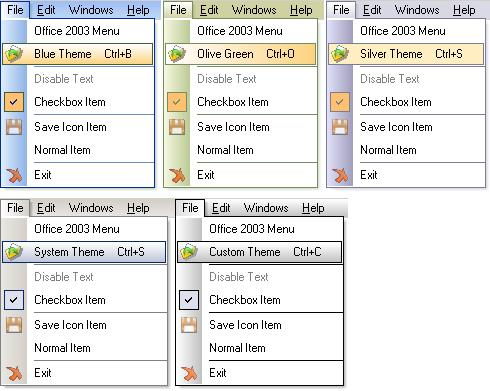



## Office2003 \(resubmitted\)

### Description

No vote is needed :)

The original code was submitted by Vlad a long time ago, I just added extra feature to support office 2003 menu. Unfortunately I was able to download Vlad's submission and made some modification to it, but when I was about to upload my modification I found out that Gary Noble (Phantom Man) has already made a submission in year 2003 that actually support 2003 menu, but I manage to incorporate some of the functionality of Gary's submission to this and made some minor modification.

sorry for my first upload, I didn't remove the other components
 
### More Info
 

             |
---                |---
**Submitted On**   |2005-06-26 23:03:02
**By**             |[dvrdsr](https://github.com/Planet-Source-Code/PSCIndex/blob/master/ByAuthor/dvrdsr.md)
**Level**          |Intermediate
**User Rating**    |5.0 (25 globes from 5 users)
**Compatibility**  |VB 6\.0
**Category**       |[OLE/ COM/ DCOM/ Active\-X](https://github.com/Planet-Source-Code/PSCIndex/blob/master/ByCategory/ole-com-dcom-active-x__1-29.md)
**World**          |[Visual Basic](https://github.com/Planet-Source-Code/PSCIndex/blob/master/ByWorld/visual-basic.md)
**Archive File**   |[Office20031906036272005\.zip](https://github.com/Planet-Source-Code/dvrdsr-office2003-resubmitted__1-61353/archive/master.zip)

